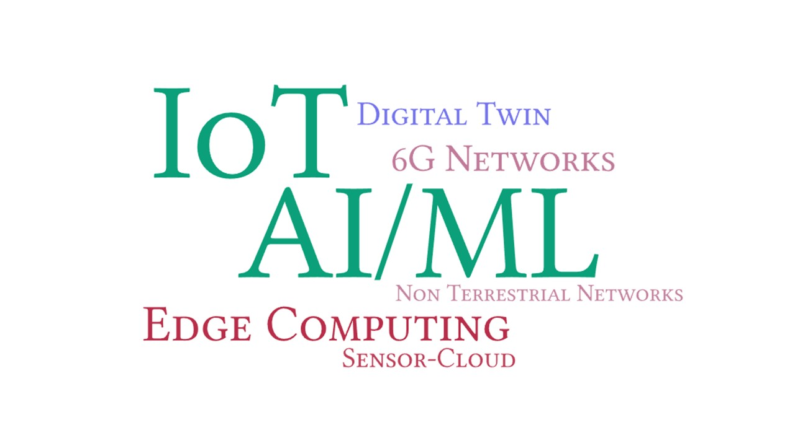

# Research

Our work is currently focused in applying AI/ML techniques for IoT and future networks. Specifically, we are working on designing intelligent solutions for Edge and Non-Terrestrial Networks, Wirelessly Powered IoT, 6G Network and Edge-Cloud-Continuum, and Digital Twin. Our lab is equipped with computing (GPU & edge) and communication modules, IoT development boards and various sensors.



## Research Projects

* Mar. 2025: AI-Powered Vision Systems for Low-light and Low-visibility Underground Mining Environments, TEXMiN Foundation (DST TIH), Amount: INR 17,35,000. (Co-PI)
* Nov. 2024: Special Lab establishment grant, IIT (ISM) Dhanbad, Amount: INR 29,97,000. (PI)
* Oct. 2023: Using Edge Intelligence for Resource Allocation in Wirelessly Powered UAV-IoT Network, SRM University-AP (Seed Grant), Amount: INR 15,24,000. (PI)
* Oct. 2018 - June 2019: Breaking the Barriers of Skin Disease Diagnosis with Computational Imaging and Artificial Intelligence, SINE, IIT Bombay and Intel Inc. (Plugin 2 Startup Cohort), Amount: INR 10,00,000. (Co-PI)
* Aug. 2015 - Jan. 2017: Multispectral Optical Imaging and Computing Technologies for Realtime in-situ Functional Characterization and Monitoring of Cutaneous Wound Healing Progression, BIRAC, DBT, Govt. of India (BIG * grant), Amount: INR 41,79,000. (Co-PI)

## Recent Publications





## All






